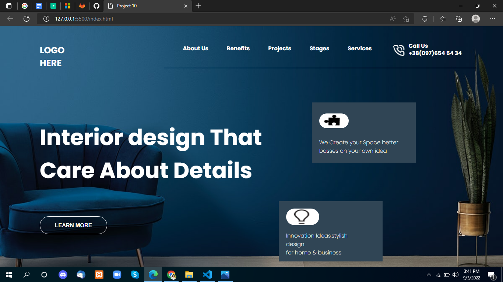

# Project-10

 

## Project live link
[https://my-project-10.netlify.app/](https://my-project-10.netlify.app/ "project10")

## Screenshot

 

## project Type
- UI Design
- One Page Website

## My learning from this Project
- Background Properties
- Font Family
- Boder-properties
- Grid

## Time to make this project
#### Approx 3 hour to make this project
